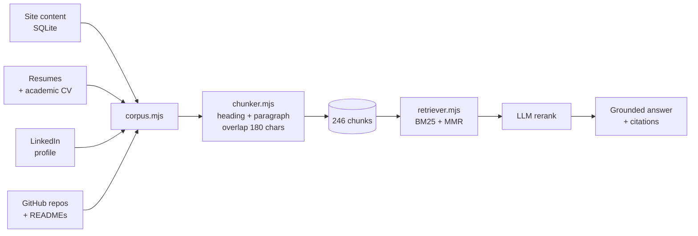
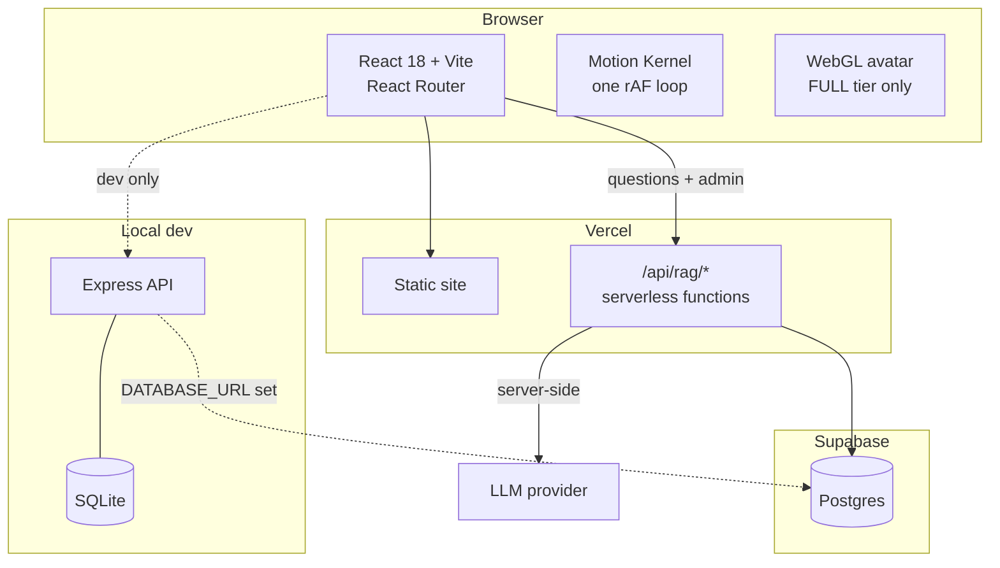

<div align="center">

# Husnain Aslam — Portfolio

### A portfolio that answers questions about itself

[](https://react.dev)
[](https://vitejs.dev)
[](https://expressjs.com)
[](https://sqlite.org)
[](https://vercel.com)


[Overview](#overview) · [The assistant](#the-assistant) · [Architecture](#architecture) · [Quick start](#quick-start) · [Deploying](#deploying-to-vercel) · [Structure](#project-structure) · [Notes](docs/ENGINEERING-NOTES.md)

</div>

---

## Overview

A four-page portfolio — Home, Projects, Blogs, About — plus a full-width
`/resume` page, a self-built admin CMS, and a retrieval-augmented assistant that
answers visitors' questions about my background from my own material.

Dark `#1a1a1b` / lime `#d0ff71`, Antonio + Inter, no UI framework. Every font,
image and decoder binary is served from the site's own origin: the page makes no
third-party requests at runtime.

| | |
|---|---|
| **Ask about my work** | A RAG assistant on the home page. Answers only from indexed passages of my projects, resumes, LinkedIn and public repositories — with citations — or says it doesn't know. |
| **Live GitHub activity** | Contribution calendar and profile stats, read server-side so the API key and the rate limit aren't every visitor's problem. |
| **Admin CMS** | Sections, projects, posts, skills, credentials and recommendations, all editable at `/admin` with drag-to-reorder. |
| **Motion kernel** | One `requestAnimationFrame` loop drives every animation on the page. Nothing else is allowed its own. |
| **Capability gating** | WebGL, kernel-driven motion, and CSS transports are chosen by device tier. `prefers-reduced-motion` switches the lot off. |

---

## The assistant

The part worth reading the code for. A visitor asks a question; it retrieves
from a corpus built out of everything I've written about my own work, and
answers **only** from what it retrieved.



**No vector database, deliberately.** The corpus is a few hundred chunks about
one person, and the questions are overwhelmingly about named things — *VLVRAG*,
*FastAPI*, *Hariyali*, *NASA POWER*. Lexical matching is exactly right for named
entities, it is deterministic, it needs no embedding endpoint, and it costs
nothing per query. Query expansion and an LLM reranking pass close the recall
gap that embeddings would otherwise cover.

**Three routes, not two.** A question with real terms and matches gets searched.
A question with real terms and no matches is refused. And a question that
reduces to *no* search terms at all — "who is he", "what does he do" — is not a
failure, it is a request for an overview, and gets one.

<details>
<summary><b>Why answers are cited, and what happens when they can't be</b></summary>

<br/>

This assistant speaks for a real person to people who may be deciding whether to
hire him. A confident wrong answer is worse than "I don't know" — inventing a
job, a grade or a metric would be a lie told in his name. So every stage is
biased toward grounding:

- The prompt forbids outside knowledge and forbids stating any number that isn't
  in a passage verbatim.
- Citations are deduplicated **before** the context is numbered. Numbering the
  context and collapsing duplicates afterwards produced lists reading
  `[1][2][3][5]`, where a `[4]` in the answer pointed at a passage the reader was
  never shown. Citations that don't resolve are worse than no citations — they
  look like evidence.
- There is no relevance threshold. Measured on this corpus the score
  distributions overlap: the weakest genuine question scores 4.35, the strongest
  junk one 5.46. Any cutoff that suppressed the junk would also suppress real
  questions, so weak matches are passed to the model *with a caution* instead.
  Withholding evidence from the judge is the worse failure.

</details>

<details>
<summary><b>Provider setup — DeepSeek by default, anything OpenAI-compatible</b></summary>

<br/>

`backend/.env` (local) or Vercel environment variables (production):

```ini
LLM_BASE_URL=https://api.deepseek.com
LLM_MODEL=deepseek-chat
LLM_API_KEY=sk-...
RAG_RATE_LIMIT=25          # questions per IP per 10 minutes
```

OpenAI, Groq, OpenRouter, Together and a local Ollama all speak the same
`/v1/chat/completions` shape — switching provider is those two URLs and nothing
else in the code.

**The key never reaches the browser.** The page calls `/api/rag/*` on its own
origin; the model provider is only ever contacted server-side. That is the whole
reason the pipeline is not in the React app.

</details>

---

## Architecture



The retrieval and generation code is **one implementation** running in two
places. `pipeline.mjs` takes an injected index provider rather than importing
the store, so locally the chunks come from SQLite and in production from a
generated module. Importing the store there would drag `better-sqlite3` — a
native binary — into a serverless bundle that can neither build nor use it.

The serverless functions have **zero npm dependencies**: eight local modules,
nothing to install.

<details>
<summary><b>The motion kernel and capability tiers</b></summary>

<br/>

Every animation — marquees, parallax, the nav's hide-on-scroll, counters, the
3D scene — is stepped by a single `requestAnimationFrame` loop with prioritised
phases (read → write → render). Components subscribe with `useTicker`. Nothing
starts its own loop, which is what keeps scroll-linked effects in step and
lets the whole page stop dead on `prefers-reduced-motion`.

| Tier | Meaning | Gets |
|---|---|---|
| `FULL` | Desktop-class, fine pointer, real WebGL2 context | Kernel-driven motion, 3D avatar |
| `MID` | Capable of CSS transitions, not WebGL | CSS transports, poster image |
| `LITE` | Small, slow, data-saving, or unknown | Static everything |

The tier is guessed pre-paint by an inline script and refined by an actual
WebGL2 probe — a device reporting eight cores but refusing a context must
degrade, not throw at mount.

</details>

---

## Quick start

```bash
git clone https://github.com/heyhusn/portfolio-website.git
cd portfolio-website

npm install                      # front end
cd backend && npm install && cd ..

cp backend/.env.example backend/.env   # add LLM_API_KEY and JWT_SECRET
cd backend && npm run seed && cd ..    # create the local database

npm run dev
```

**One command runs everything** — Vite on `:5173` and the API on `:3001`, in one
terminal with prefixed output, stopping together on Ctrl-C. The API builds the
assistant's knowledge base on boot if it's missing, and logs whether it came up
ready:

```
site  → http://localhost:5173
api   → http://localhost:3001  (admin panel + RAG assistant)

api │ [rag] indexed 246 chunks from 59 documents.
api │ [rag] assistant ready — 246 chunks, model deepseek-chat
web │   ➜  Local:   http://localhost:5173/
```

| Command | Does |
|---|---|
| `npm run dev` | Front end **and** API together |
| `npm run dev:web` / `dev:api` | Either one alone |
| `npm run build` | Production build: model-budget check → content snapshot → Vite → per-route metadata |
| `npm run snapshot` | Just the content snapshot (needs `DATABASE_URL`; see [First paint is the final paint](#first-paint-is-the-final-paint)) |
| `npm test` | The suite — 60 tests across the motion kernel, capability tiers, avatar gates, marquee transport, model budget, retrieval and accessibility |
| `npm run test:watch` | Same, in watch mode |
| `npm run verify` | `test` then `build` — what CI runs |
| `cd backend && npm run setup` | Migrate, index, and export the production knowledge base |
| `cd backend && npm run refresh:github` | Re-pull repositories and READMEs |

Admin panel: `/login` — username `admin`, password from `SEED_ADMIN_PASSWORD`.

---

## Deploying to Vercel

```bash
cd backend && npm run export:index    # writes api/_rag-index.js — commit it
```

Then in **Settings → Environment Variables**, set:

| Variable | Why |
|---|---|
| `LLM_API_KEY` | The assistant cannot answer without it |
| `JWT_SECRET` | **Required.** At least 32 characters — see below |
| `DATABASE_URL` | Supabase pooler URI; the admin panel needs it |

Add `LLM_BASE_URL` / `LLM_MODEL` too if you have moved off DeepSeek. Then deploy.

> [!WARNING]
> **`JWT_SECRET` is not optional in production.** The local Express server
> generates a random one when it is missing, which is safe for a single
> long-lived process. Anywhere the process restarts it is actively harmful:
> every restart mints a new secret, so every token issued before it stops
> verifying and the admin is signed out with no explanation. On serverless it
> is worse — each instance would generate its own, so whether a session worked
> would depend on which instance answered.
>
> So the server **refuses to start** without one when `NODE_ENV=production` or
> `DATABASE_URL` is set, and the serverless routes return 503 rather than
> falling back. Generate one with:
>
> ```bash
> node -e "console.log(require('crypto').randomBytes(48).toString('hex'))"
> ```
>
> A secret shorter than 32 characters is rejected the same way: it can be
> brute-forced offline from any token, and a token is a login.

`GET /api/health` reports which data store is live and whether the secret and
LLM key are configured — without printing any of their values. It is the
fastest answer to "why is the admin panel failing on the deployed site".

> [!IMPORTANT]
> `api/_rag-index.js` looks like a build artefact and is deliberately **not**
> gitignored. Vercel has no database, so that file *is* the assistant's
> knowledge base in production. Re-export and redeploy whenever content changes.

> [!NOTE]
> **The admin panel works in production**, writing to Postgres. It used to be
> local-only — the content routes existed on the Express server but not as
> functions, so on the deployed site they 404'd and the page fell back to
> whatever was bundled at build time. `api/profile.js`, `projects`, `posts`,
> `site`, `sections` and `auth/login` now cover them.

---

## Database

One interface, two drivers, chosen by a single environment variable:

| `DATABASE_URL` | Driver | Where |
|---|---|---|
| unset | SQLite (`backend/portfolio.db`) | Local development — zero setup |
| set | Postgres | Production |

**Production needs Postgres, not SQLite.** Vercel functions run on an ephemeral
filesystem: a write to a local `.db` file succeeds, and then vanishes when the
instance recycles. The failure mode is the bad kind — it looks like it worked.

### Moving to Supabase

```bash
# 1. Supabase → Project Settings → Database → Connection string → URI
#    Use the connection POOLER uri (port 6543), not the direct one.
echo 'DATABASE_URL=postgresql://...pooler.supabase.com:6543/postgres' >> backend/.env

cd backend
npm run db:push       # create the schema — idempotent
npm run db:migrate    # copy your local SQLite data across, including the
                      # bcrypt admin hash, so your password keeps working
```

Then set `DATABASE_URL` and `JWT_SECRET` in **Vercel → Settings → Environment
Variables** and redeploy. Unset `DATABASE_URL` locally to drop back to SQLite;
the server prints which store it booted against.

<details>
<summary><b>Two things the driver split gets right, and why they look odd</b></summary>

<br/>

**The two drivers are imported differently, on purpose.** `data/index.mjs`
imports Postgres statically so a bundler traces it and includes the `postgres`
package in the function — and resolves SQLite from a specifier assembled at
runtime so that same tracer does *not* follow it into `better-sqlite3`, a
native module that is deliberately not a production dependency and cannot be
built on a serverless host. Two static imports would try to bundle a binary
nothing uses; two dynamic ones would leave out the driver production needs.

**`prepare: false` and `max: 1`.** Supabase's transaction pooler does not keep
a session between statements, so named prepared statements break against it. And
a connection pool per serverless instance, multiplied by instances, is how you
exhaust Postgres connections during a traffic spike.

</details>

---

## Project structure

```
├── api/                      Vercel serverless functions (production chatbot)
│   ├── _rag-index.js         generated knowledge base — committed on purpose
│   ├── _engine.js            index provider, rate limiting, request helpers
│   ├── _admin.js             auth, CORS and body parsing for the admin routes
│   ├── rag/                  meta · ask · stream
│   ├── auth/login.js         issues the admin token
│   └── profile · projects · posts · site · sections
├── backend/                  Express API — admin CMS + local RAG
│   ├── data/                 one repository interface, two drivers
│   │   ├── postgres.mjs      production (Supabase)
│   │   ├── sqlite.mjs        local development
│   │   ├── schema.pg.sql     Postgres DDL
│   │   └── migrate-to-postgres.mjs
│   ├── rag/
│   │   ├── corpus.mjs        four sources → documents
│   │   ├── chunker.mjs       heading- and paragraph-aware splitting
│   │   ├── retriever.mjs     BM25, query expansion, MMR
│   │   ├── pipeline.mjs      retrieve → rerank → grounded answer
│   │   └── sources/          resumes, LinkedIn, GitHub READMEs
│   └── server.mjs
├── src/
│   ├── components/           Nav, Marquee, AskAssistant, SkillsSection …
│   ├── motion/               kernel, capability tiers, hooks
│   ├── pages/                Home, About, Projects, Blogs, Resume, admin
│   └── wgl/                  lazy WebGL chunk (avatar)
├── docs/ENGINEERING-NOTES.md decisions, trade-offs and the bugs behind them
└── vercel.json
```

---

<div align="center">

**[Engineering notes →](docs/ENGINEERING-NOTES.md)**

Built by [Husnain Aslam](https://linkedin.com/in/husnain-aslam-0a959a1a7) · [github.com/heyhusn](https://github.com/heyhusn)

</div>

### Failing loudly enough, and only where it helps

The store falls back to content bundled at build time when the API is
unreachable. That is the right behaviour — the site stays up — but it used to
do it *silently in production*: the warning was behind `import.meta.env.DEV`,
so a broken API looked like a perfectly healthy site serving frozen content,
and the first symptom was an admin edit that "didn't show up".

Three different audiences, three different treatments:

| Who | Sees |
|---|---|
| Visitor | Nothing. The page renders from bundled content, as before |
| Anyone with devtools open | One `console.warn` naming the URL tried and the likely cause |
| Admin at `/admin` | A banner: *the content API is not responding, edits will fail to save* |

The banner matters most. A silent fallback is correct for a visitor and wrong
for someone about to spend ten minutes editing content that cannot be saved.

**On CORS specifically:** a CORS rejection and a dead server are
indistinguishable from JavaScript — both arrive as a request with no response
and no status, because the spec deliberately hides cross-origin failure detail
from the page. So the diagnostic does not guess. It prints the two facts that
settle it: the API base being called and the origin calling it. If they differ,
CORS is possible and the message says which variable to set; if they match, it
says so, because CORS cannot apply to a same-origin request.

That is also why a missing `CORS_ORIGIN` does not break the deployed site: the
built frontend calls same-origin `/api`, so no CORS check happens at all. The
variable only matters when the API is hosted somewhere else.

The functions do **not** send `Access-Control-Allow-Origin: *`. They reflect the
origin when it matches the request host or appears in `CORS_ORIGIN`, add `Vary:
Origin` so a cache cannot serve one origin's response to another, and otherwise
send no header and log the refusal. A wildcard would hand every site on the
internet the ability to call the admin routes from a visitor's browser, to buy
nothing production needs.

## Link previews and SEO

The site is a client-rendered SPA, which normally means one set of hardcoded
`<meta>` tags for every route. It doesn't here: `scripts/prerender-meta.mjs`
runs after `vite build` and writes **a real HTML file per route**, each with its
own title, description, canonical, OpenGraph and Twitter tags.

> [!IMPORTANT]
> **React Helmet would not fix link previews, and it is worth knowing why.**
> X, LinkedIn, Facebook, Slack and WhatsApp do not execute JavaScript. They
> fetch the URL, parse the `<head>`, and leave. Anything a client-side library
> writes after React mounts is invisible to every one of them — the preview
> would still show whatever was hardcoded in `index.html`. The tags that matter
> for a shared link have to be in the document when it arrives, which is what
> the prerender step does.
>
> Helmet-style runtime updating is still worth having for the browser tab and
> for Google, which does render JS. That is `src/lib/meta.js` — twelve lines,
> no dependency. It is a complement, not the fix.

Two bugs found while implementing this, both of which meant previews were
broken *today*, not just stale:

- **`og:image` was a relative path.** Every major crawler ignores a relative
  image URL, so no preview image was rendering at all. They are absolute now,
  built from `SITE_URL` (or Vercel's `VERCEL_PROJECT_PRODUCTION_URL`).
- **No `twitter:card`.** Without it X renders no card whatsoever, rather than a
  plain one. Also added: `og:url`, `og:site_name`, `canonical`, and a
  `Person` JSON-LD block on the home page.

The prerender reads from **Postgres when `DATABASE_URL` is set**, and from
`src/data/` otherwise. So content edited in the admin panel reaches link
previews on the next deploy — verified by editing a tagline directly in the
database and re-running the step.

`sitemap.xml` and `robots.txt` are generated at the same time; `robots.txt`
disallows `/admin` and `/login`.

### The one thing this does not do

Previews reflect content **as of the last build**. Edit the tagline in the admin
panel and the site updates instantly — the store reads live data — but a link
shared on LinkedIn keeps the previous preview until a redeploy regenerates the
HTML. That is the honest boundary of static prerendering.

If that becomes a real problem, the options in ascending order of effort are: a
Vercel Deploy Hook fired after a content save; Edge Middleware that injects tags
for crawler user-agents; or a framework with real SSR. None is worth it for a
portfolio whose tagline changes a few times a year — but the constraint should
be a decision, not a surprise.

## First paint is the final paint

Rendering from bundled content is what makes the site appear instantly and stay
up when the API doesn't (see [Database](#database)). The cost was that the
bundled copy was written by hand and the live copy came from the database, so
for a few hundred milliseconds a visitor read one version and then watched it
become another — a headline changing, a card appearing, the page below it
sliding down.

Three things now make the two versions the same:

| Source of the change | What it does |
| --- | --- |
| `scripts/snapshot-content.mjs` | Reads the database at build time and writes the live payload into `src/data/snapshot.generated.js`, which `fallback.js` prefers over the hand-written content. First paint and the API response are the same bytes on any deploy nobody has edited since. |
| A no-op guard in `src/store.js` | An incoming payload identical to the current one keeps the existing object, so Zustand's reference comparison doesn't re-render a tree that cannot have changed. |
| Skeletons for the genuinely unknown | The GitHub calendar is a live third-party call and the assistant's readiness is a runtime fact; neither can be known at build time. Both now render at full size while loading — 53 empty weeks, four blank stat tiles, the starter chips from the shared list — so the arrival changes colours and numbers, never geometry. |

Measured with Playwright by holding the content API for 1.2s, snapshotting the
DOM at first paint and again after the response: **every section is the same
height before and after**, where the GitHub block alone used to grow by 318px
and the assistant by 24px.

The snapshot never fails a build. No `DATABASE_URL`, an unreachable database or
an unseeded one all leave it `null`, and the build carries on with the bundled
content exactly as before. Drafts are stripped from it — the site never renders
them, and they have no business in a file every visitor downloads.

> [!NOTE]
> Content edited in the admin panel still arrives the way it always did: the
> store fetches on mount and the change appears. The snapshot only removes the
> case where *nothing had changed* and the page repainted anyway.

### Off-screen animation

`useInViewport` in `src/motion/hooks.js` gates Motion Kernel subscribers on
visibility. The kernel already stopped the whole loop on a hidden tab; this
covers the other case — an element that has scrolled out of the viewport on a
tab that is very much visible. The marquees and the flowing portrait now write
zero styles per frame while off screen (measured with a `MutationObserver` on
the `style` attribute), and the 20% `rootMargin` means they are back in step
before they are visible again.
