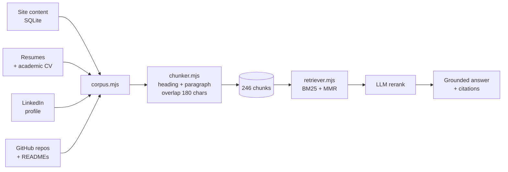
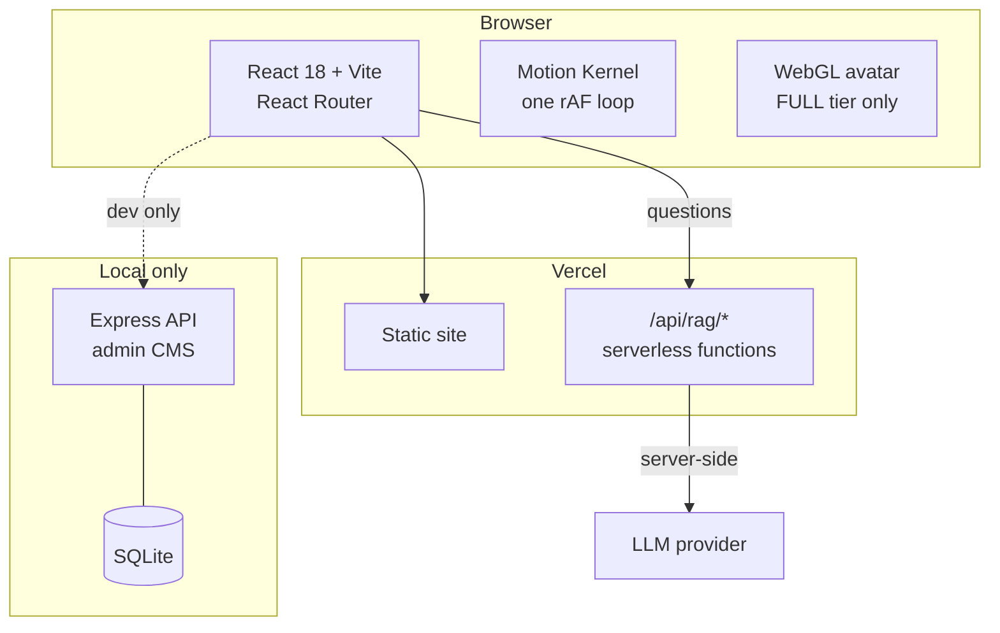

<div align="center">

# Husnain Aslam — Portfolio

### A portfolio that answers questions about itself

[](https://react.dev)
[](https://vitejs.dev)
[](https://expressjs.com)
[](https://sqlite.org)
[](https://vercel.com)


[Overview](#overview) · [The assistant](#the-assistant) · [Architecture](#architecture) · [Quick start](#quick-start) · [Deploying](#deploying-to-vercel) · [Structure](#project-structure) · [Notes](docs/ENGINEERING-NOTES.md)

</div>

---

## Overview

A four-page portfolio — Home, Projects, Blogs, About — plus a full-width
`/resume` page, a self-built admin CMS, and a retrieval-augmented assistant that
answers visitors' questions about my background from my own material.

Dark `#1a1a1b` / lime `#d0ff71`, Antonio + Inter, no UI framework. Every font,
image and decoder binary is served from the site's own origin: the page makes no
third-party requests at runtime.

| | |
|---|---|
| **Ask about my work** | A RAG assistant on the home page. Answers only from indexed passages of my projects, resumes, LinkedIn and public repositories — with citations — or says it doesn't know. |
| **Live GitHub activity** | Contribution calendar and profile stats, read server-side so the API key and the rate limit aren't every visitor's problem. |
| **Admin CMS** | Sections, projects, posts, skills, credentials and recommendations, all editable at `/admin` with drag-to-reorder. |
| **Motion kernel** | One `requestAnimationFrame` loop drives every animation on the page. Nothing else is allowed its own. |
| **Capability gating** | WebGL, kernel-driven motion, and CSS transports are chosen by device tier. `prefers-reduced-motion` switches the lot off. |

---

## The assistant

The part worth reading the code for. A visitor asks a question; it retrieves
from a corpus built out of everything I've written about my own work, and
answers **only** from what it retrieved.



**No vector database, deliberately.** The corpus is a few hundred chunks about
one person, and the questions are overwhelmingly about named things — *VLVRAG*,
*FastAPI*, *Hariyali*, *NASA POWER*. Lexical matching is exactly right for named
entities, it is deterministic, it needs no embedding endpoint, and it costs
nothing per query. Query expansion and an LLM reranking pass close the recall
gap that embeddings would otherwise cover.

**Three routes, not two.** A question with real terms and matches gets searched.
A question with real terms and no matches is refused. And a question that
reduces to *no* search terms at all — "who is he", "what does he do" — is not a
failure, it is a request for an overview, and gets one.

<details>
<summary><b>Why answers are cited, and what happens when they can't be</b></summary>

<br/>

This assistant speaks for a real person to people who may be deciding whether to
hire him. A confident wrong answer is worse than "I don't know" — inventing a
job, a grade or a metric would be a lie told in his name. So every stage is
biased toward grounding:

- The prompt forbids outside knowledge and forbids stating any number that isn't
  in a passage verbatim.
- Citations are deduplicated **before** the context is numbered. Numbering the
  context and collapsing duplicates afterwards produced lists reading
  `[1][2][3][5]`, where a `[4]` in the answer pointed at a passage the reader was
  never shown. Citations that don't resolve are worse than no citations — they
  look like evidence.
- There is no relevance threshold. Measured on this corpus the score
  distributions overlap: the weakest genuine question scores 4.35, the strongest
  junk one 5.46. Any cutoff that suppressed the junk would also suppress real
  questions, so weak matches are passed to the model *with a caution* instead.
  Withholding evidence from the judge is the worse failure.

</details>

<details>
<summary><b>Provider setup — DeepSeek by default, anything OpenAI-compatible</b></summary>

<br/>

`backend/.env` (local) or Vercel environment variables (production):

```ini
LLM_BASE_URL=https://api.deepseek.com
LLM_MODEL=deepseek-chat
LLM_API_KEY=sk-...
RAG_RATE_LIMIT=25          # questions per IP per 10 minutes
```

OpenAI, Groq, OpenRouter, Together and a local Ollama all speak the same
`/v1/chat/completions` shape — switching provider is those two URLs and nothing
else in the code.

**The key never reaches the browser.** The page calls `/api/rag/*` on its own
origin; the model provider is only ever contacted server-side. That is the whole
reason the pipeline is not in the React app.

</details>

---

## Architecture



The retrieval and generation code is **one implementation** running in two
places. `pipeline.mjs` takes an injected index provider rather than importing
the store, so locally the chunks come from SQLite and in production from a
generated module. Importing the store there would drag `better-sqlite3` — a
native binary — into a serverless bundle that can neither build nor use it.

The serverless functions have **zero npm dependencies**: eight local modules,
nothing to install.

<details>
<summary><b>The motion kernel and capability tiers</b></summary>

<br/>

Every animation — marquees, parallax, the nav's hide-on-scroll, counters, the
3D scene — is stepped by a single `requestAnimationFrame` loop with prioritised
phases (read → write → render). Components subscribe with `useTicker`. Nothing
starts its own loop, which is what keeps scroll-linked effects in step and
lets the whole page stop dead on `prefers-reduced-motion`.

| Tier | Meaning | Gets |
|---|---|---|
| `FULL` | Desktop-class, fine pointer, real WebGL2 context | Kernel-driven motion, 3D avatar |
| `MID` | Capable of CSS transitions, not WebGL | CSS transports, poster image |
| `LITE` | Small, slow, data-saving, or unknown | Static everything |

The tier is guessed pre-paint by an inline script and refined by an actual
WebGL2 probe — a device reporting eight cores but refusing a context must
degrade, not throw at mount.

</details>

---

## Quick start

```bash
git clone https://github.com/heyhusn/portfolio-website.git
cd portfolio-website

npm install                      # front end
cd backend && npm install && cd ..

cp backend/.env.example backend/.env   # add LLM_API_KEY and JWT_SECRET
cd backend && npm run seed && cd ..    # create the local database

npm run dev
```

**One command runs everything** — Vite on `:5173` and the API on `:3001`, in one
terminal with prefixed output, stopping together on Ctrl-C. The API builds the
assistant's knowledge base on boot if it's missing, and logs whether it came up
ready:

```
site  → http://localhost:5173
api   → http://localhost:3001  (admin panel + RAG assistant)

api │ [rag] indexed 246 chunks from 59 documents.
api │ [rag] assistant ready — 246 chunks, model deepseek-chat
web │   ➜  Local:   http://localhost:5173/
```

| Command | Does |
|---|---|
| `npm run dev` | Front end **and** API together |
| `npm run dev:web` / `dev:api` | Either one alone |
| `npm run build` | Production build (runs the 3D model budget check first) |
| `cd backend && npm run setup` | Migrate, index, and export the production knowledge base |
| `cd backend && npm run refresh:github` | Re-pull repositories and READMEs |

Admin panel: `/login` — username `admin`, password from `SEED_ADMIN_PASSWORD`.

---

## Deploying to Vercel

```bash
cd backend && npm run export:index    # writes api/_rag-index.js — commit it
```

Then in **Settings → Environment Variables**, set `LLM_API_KEY` (plus
`LLM_BASE_URL` / `LLM_MODEL` if you're not on DeepSeek), and deploy.

> [!IMPORTANT]
> `api/_rag-index.js` looks like a build artefact and is deliberately **not**
> gitignored. Vercel has no database, so that file *is* the assistant's
> knowledge base in production. Re-export and redeploy whenever content changes.

> [!NOTE]
> The admin CMS is local-only by design. Its routes live on the Express server,
> not as serverless functions, so on the deployed site they 404 and the store
> falls back to the content bundled in `src/data/`. An admin API on a public host
> needs a database and a hardening pass a static portfolio doesn't otherwise
> require. Edit locally, re-export, redeploy.

---

## Project structure

```
├── api/                      Vercel serverless functions (production chatbot)
│   ├── _rag-index.js         generated knowledge base — committed on purpose
│   ├── _engine.js            index provider, rate limiting, request helpers
│   └── rag/                  meta · ask · stream
├── backend/                  Express API — admin CMS + local RAG
│   ├── rag/
│   │   ├── corpus.mjs        four sources → documents
│   │   ├── chunker.mjs       heading- and paragraph-aware splitting
│   │   ├── retriever.mjs     BM25, query expansion, MMR
│   │   ├── pipeline.mjs      retrieve → rerank → grounded answer
│   │   └── sources/          resumes, LinkedIn, GitHub READMEs
│   └── server.mjs
├── src/
│   ├── components/           Nav, Marquee, AskAssistant, SkillsSection …
│   ├── motion/               kernel, capability tiers, hooks
│   ├── pages/                Home, About, Projects, Blogs, Resume, admin
│   └── wgl/                  lazy WebGL chunk (avatar)
├── docs/ENGINEERING-NOTES.md decisions, trade-offs and the bugs behind them
└── vercel.json
```

---

<div align="center">

**[Engineering notes →](docs/ENGINEERING-NOTES.md)**

Built by [Husnain Aslam](https://linkedin.com/in/husnain-aslam-0a959a1a7) · [github.com/heyhusn](https://github.com/heyhusn)

</div>
